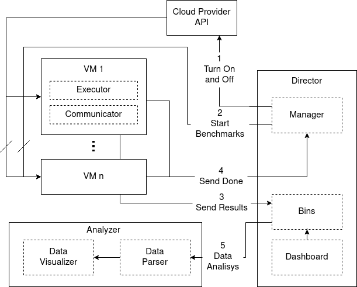

# VMBS-tool
The VMBS-tool is an expandable and customizable benchmark application designed for running benchmarks on the cloud.
The toolkit is able to start a machine, run a suite of benchmarks, store the results in a remote database and stop the machine when the suite is executed.

**The datasets are available [here](http://doi.org/10.5281/zenodo.4750886) to be downloaded. The results are available in the Analyzer repository.**



The application is composed by:

1. Manager
2. Executor
3. Communicator
4. Bins
5. Dashboard
6. Analyzer

The components work together in order to:

- manage VMs running on the cloud
- run benchmarks
- collect and store benchmark results
- parse and visualize benchmarks results

#### 1. Manager
This component manages the VMs and it is designed to:

- initialize a VM with the benchmark dependencies
- communicate with the cloud provider API, for example to turn on or off a machine
- run a suite of benchmarks on a machine

It is developed using Ansible playbooks and a custom script. Currently the manager works with the AWS and the Azure providers.

The "start" playbook reads a configuration file, where the information about the VMs are stored, and it starts a set of machines communicating with the cloud provider APIs. It exploits the Ansible modules `ec2` and `azure_rm_virtualmachine`. The "stop" playbook stops a given set of machines.

A VM needs to be initialized with benchmark dependencies before it can be added to the set of benchmarked machines. The "init" playbook installs all the dependencies needed to run the benchmark provided with the default suite:

- sysbench
- wrk
- custom benchmarks provided by the CloudBenchmark suite
It downloads and setups [Communicator](https://github.com/NicholasRasi/VMBS-tool-Communicator), it copies the benchmark configuration file and the script that starts [Executor](https://github.com/NicholasRasi/VMBS-tool-Executor) and [Communicator](https://github.com/NicholasRasi/VMBS-tool-Communicator). When the initialization phase is completed the machine is ready to execute and send the results of the benchmarks to the [Bins](https://github.com/NicholasRasi/BinDatabase) component.

The "update" playbook provides a useful way to update a machine, updating the [Executor](https://github.com/NicholasRasi/VMBS-tool-Executor) and [Communicator](https://github.com/NicholasRasi/VMBS-tool-Communicator) without running a full initialization.

The "run" playbook launches the script that starts [Executor](https://github.com/NicholasRasi/VMBS-tool-Executor) and [Communicator](https://github.com/NicholasRasi/VMBS-tool-Communicator) on the VM.

The other scripts are helpers that allow to execute start-init, start-run and start-update together.

The Manager reads:

- the benchmark configuration file: it describes which benchmarks have to be performed and how many times. It provides a description of the benchmark setup, when needed.
- the benchmark tools configuration file: it contains information needed by [Communicator](https://github.com/NicholasRasi/VMBS-tool-Communicator) component, such as where the file with the benchmark results is stored locally, where to send the result and the webhook that needs to be called when the benchmarks are completed.
- vars file: it provides all the information about the VMs and how they can be accessed, such as the folder with the keys, etc.

The Manager also provides a webhook that allow the execution of a command for a set of VMs, e.g. to stop a machine. This webhook is exploited by the [Communicator](https://github.com/NicholasRasi/VMBS-tool-Communicator) when the execution of the benchmark is completed and the machine needs to be turned off. The script can be also run through the command line.

#### 2. Executor
This component is installed on every VM that runs benchmarks. It is decoupled from the rest of the application and can be used as a standalone tool. It reads a configuration file that contains all the information about the benchmark suite. A suite is composed by microbenchmarks that can be executed multiple times with different configurations. The configuration file is a YAML file that contains a list of benchmarks represented by their name, the number of repetition and the setup, if any. An example of configuration file can be:
```yaml
benchmarks:
  "dd":
    repeat: 5
    setup:
      - { bs: "256MB", count: 1 }
      - { bs: "512", count: 1000 }
  "simple-cpu":
    repeat: 5
    setup:
      - {}
```
This file instructs the runner to execute the dd and the simple-cpu benchmark 5 times each with the provided configuration. The list of built-in benchmarks are:

- System:
	- [sysbench](https://github.com/akopytov/sysbench): sysbench is a scriptable multi-threaded benchmark tool for CPU, memory, threads, fileio. To better execute sysbench commands a [sysbench Python wrapper](https://github.com/NicholasRasi/python_sysbench) was developed to run sysbench command as Python functions.
	- [nench](https://github.com/n-st/nench): a VPS benchmark script based on the popular bench.sh, plus CPU and ioping tests, and dual-stack IPv4 and v6 speedtests by default
- Hardware:
	- CPUBenchmark: run a simple CPU benchmark
	- DDBenchmark: dd command is used to monitor the writing performance of a disk device
	- DownloadBenchmark: download a sample file from a URL and measure the speed
- Application:
	- [ai-benchmark](https://pypi.org/project/ai-benchmark/): AI Benchmark is an open source python library for evaluating AI performance of various hardware platforms, including CPUs, GPUs and TPUs.
	- [gunicorn](https://gunicorn.org/) web server + [wrk](https://github.com/wg/wrk): wrk is a modern HTTP benchmarking tool capable of generating a load

The runner also collects information about the machine such as the processor type and the amount of memory.

Benchmarks are executed following the Randomized Multiple Trials (RMT) similar to the methodology suggested by
> Conducting Repeatable Experiments in Highly Variable Cloud Computing Environments by Ali Abedi and Tim Brecht
in order to get precise results.

 When the suite is completed the results are saved into a file that can be viewed or sent to a database. The file contains the raw outputs of the executed benchmarks, i.e. no parsification of the output is performed on the machine. The user can easily integrate other benchmarks in the tool.

#### 3. Communicator
This component is developed to:

- extract VM metadata, such as the provider and the machine id directly from the machine. The metadata are used to associate the machine with the benchmark data. This is done only when this component is executed for the first time. 
- read the benchmark file and send the data to the database
- send the poweroff request to the [Manager](https://github.com/NicholasRasi/VMBS-tool-Director) when the data has been sent and the machine can be turned off.
It reads a configuration file that specifies the database URL, the webhook where to send the poweroff request and the benchmark file location.

#### 4. Bins
A minimal database where storing benchmarks results was designed: it is lightweight, requires minimal dependencies and it is easily deployable. The database is structured as bins, one for each VM, where the benchmark data is inserted when a new benchmark is executed. The database exposes a REST interface where to post and get data.

#### 5. Dashboard
This component is designed to monitor the benchmarking process. It allows to visualize the

- number of VMs used for benchmarks
- number of executed benchmarks
- number of total microbenchmarks executed
- number of errors raised during the execution
- the list of VMs with the time of the last executed benchmark and the number of collected samples for the machine
The dashboard only requires the URL of the database.


#### 6. Analyzer
The data parser allows to extract and visualize the benchmark results from the raw benchmark output, saved to the benchmarks output file. The information is extracted from the raw output of the commands through regular expression. For each benchmark is extracted: the name of the benchmark value, e.g. cpu - sha256, the extracted value e.g. 3.279, and the measurement unit, e.g. seconds. A microbenchmark can be executed multiple times with different setup in the same run. The Analyzer compute the mean value for each test/setup/machine.

This component allows to group and show interactive plots of the data.

---

The Manager, the Bins and the Dashboard are hosted on a master machine that is always on while the VMs, where the benchmarks are executed, are turned on periodically when the start-run playbook is executed. We executed the script every hour. The machine exploits the cloud provider APIs to start the VMs. When the machine is ready, the CloudBenchmark component starts, executes the benchmarks and save the results in a file when the suite is completed. After that, the CloudBenchmarkCommunicator read the file and sends the results to the remote database. When the results are transferred it issues the power off request to the VMs manager. The manager then sends the command to the cloud provider API.

We have executed the tests for one month on AWS, Azure, GPC and EGI using the following VMs:
- AWS:
	- a1.large: vCPU: 2, RAM: 4 GiB
	- a1.xlarge: vCPU: 4, RAM: 8 GiB
	- m5.large: vCPU: 2, RAM: 8 GiB
	- m5.xlarge: vCPU: 4, RAM: 16 GiB
- Azure:
	- A2v2: vCPU: 2, RAM: 4 GiB
	- A4v2: vCPU: 4, RAM: 8 GiB
	- B2MS: vCPU: 2, RAM: 8 GiB
	- B4MS: vCPU: 4, RAM: 16 GiB
- GCP:
	- E2-T1: vCPU: 2, RAM: 4 GiB
	- E2-T2: vCPU: 4, RAM: 8 GiB
	- N1-T1: vCPU: 2, RAM: 8 GiB
	- N1-T2: vCPU: 4, RAM: 16 GiB
- EGI:
	- T1: vCPU: 2, RAM: 4 GiB
    - T2: vCPU: 4, RAM: 8 GiB
    - T3: vCPU: 2, RAM: 8 GiB
    - T4: vCPU: 4, RAM: 16 GiB
